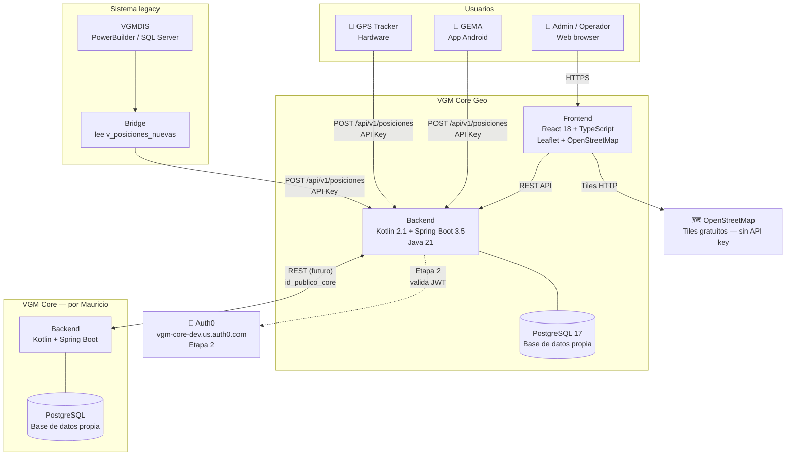
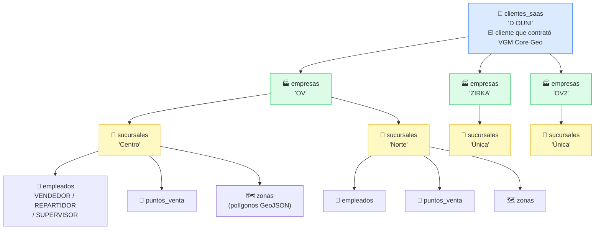
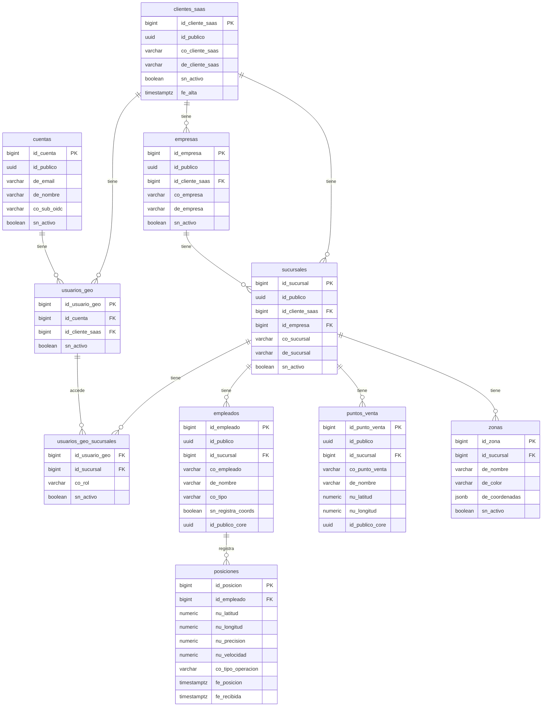
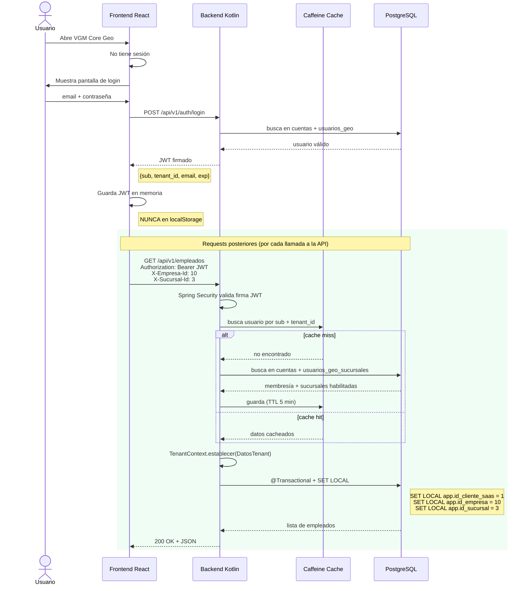
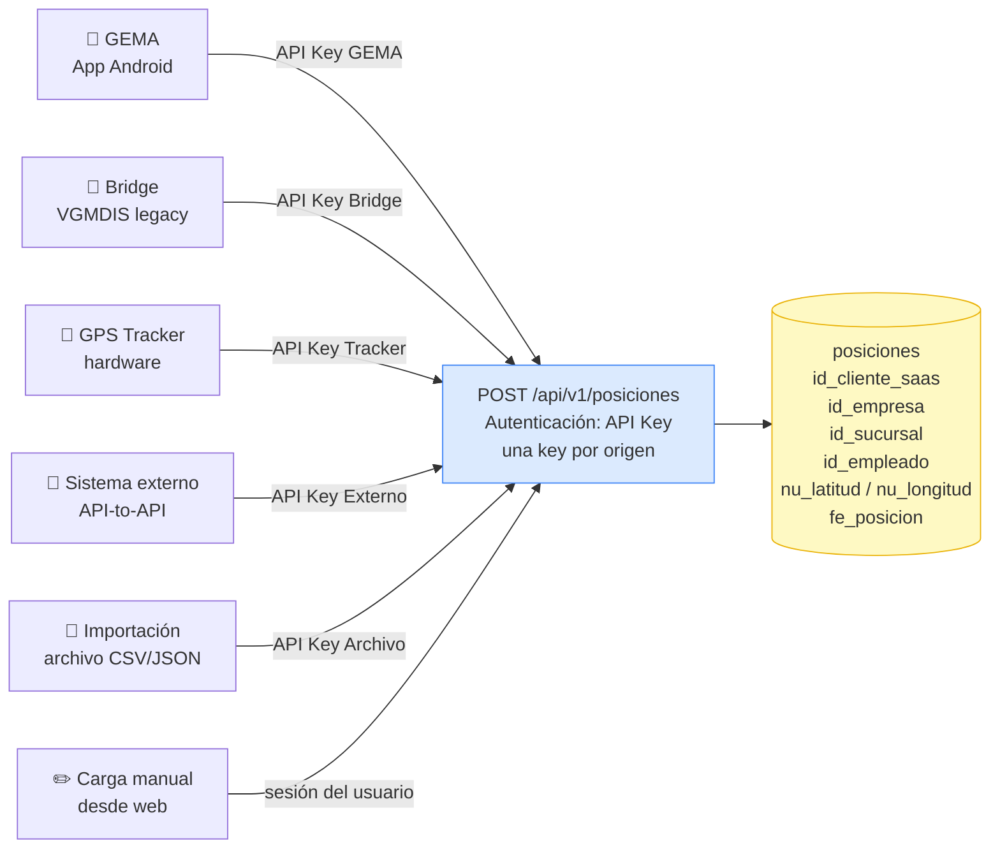
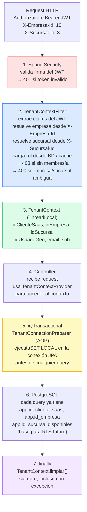
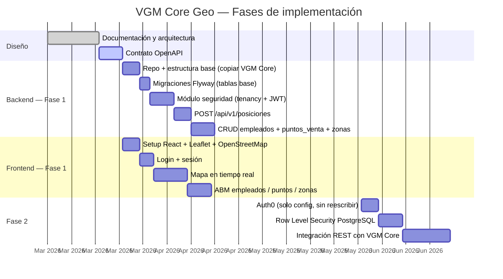

# Arquitectura visual — VGM Core Geo

> Diagramas de referencia. Se renderizan en GitHub y en cualquier editor compatible con Mermaid.
> Última actualización: 2026-03-16

---

## 1. Contexto del sistema

Quién usa VGM Core Geo, qué sistemas lo rodean y cómo se conectan.

---

## 2. Jerarquía de tenancy

Cómo se organizan los datos dentro de VGM Core Geo. Idéntica a VGM Core.

---

## 3. Modelo de datos — tablas y relaciones

---

## 4. Flujo de autenticación — Etapa 1 (JWT propio)

---

## 5. Ingesta de posiciones GPS

Seis fuentes distintas, todas apuntan al mismo endpoint con API Key.

---

## 6. Cadena de filtros por request

Cómo viaja un request HTTP desde que llega hasta que el controller lo procesa.

---

## 7. Roadmap de implementación

